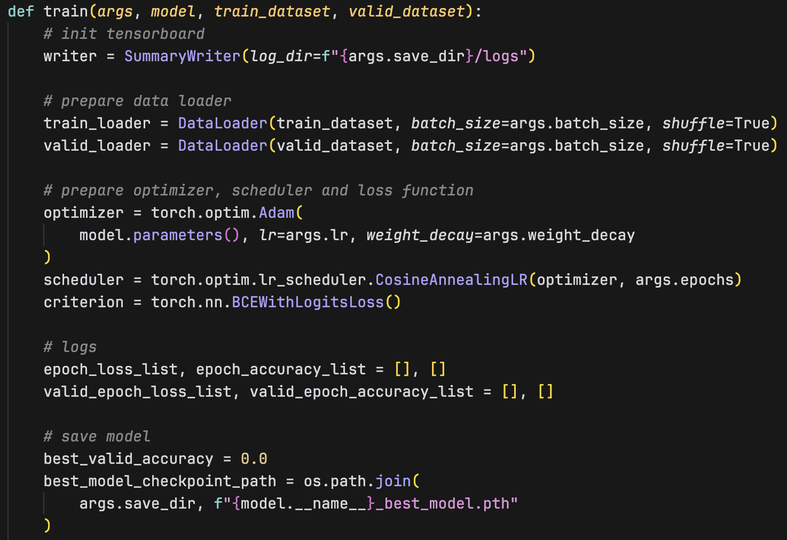

# DLP lab 3

## Overview
This lab aims to perform the binary semantic segmentation on the _Oxford-IIIT Pet Dataset_ using UNet and ResNet34_UNet. The dataset contains 37 categories of pets with pixel-level annotations. The goal is to segment the pet from the background. UNet is a popular architecture for semantic segmentation, and ResNet34_UNet is a combination of ResNet34 and UNet. The lab also includes data preprocessing, training, evaluation, and inference.

## Implementation Details
### Code Explanation
#### Training Code
First, the argument parser is defined to parse the input arguments. The parser includes the following arguments:
- `--data_path`: path to the dataset
- `--seed`: random seed
- `--epochs`: number of epochs
- `--lr`: learning rate
- `--weight_decay`: weight decay
- `--batch_size`: batch size
- `--model`: model architecture (UNet or ResNet34_UNet)
- `--save_dir`: directory to save the model
- `--mask_threshold`: mask threshold value for binary segmentation

Then, the random seed is set using the following function to ensure reproducibility.


Third, the train/validation dataset is loaded using the custom `OxfordPetDataset`.
After that, the UNet/ResNet34_UNet model is initialized, and passed to the `train` function.


Inside the `train` function, I use `tensorboard` to log the training accuracy/loss, validation accuracy/loss, and the predicted mask along with the ground truth mask and the input image for visualization.
The `Adam` optimizer is used with the specified learning rate and weight decay. The `BCEWithLogitsLoss` is used as the loss function. The model will output one channel mask, which is then being passed through sigmoid and thresholded to get the binary mask (in the `convert_output_to_binary_mask` function).


Then, we enter the training loop. The model is set to train mode, and the dataloader is iterated. The input image and the ground truth mask are passed to the model, and the model outputs the predicted mask. 
After that, the loss and accuracy are calculated, and the gradients are backpropagated. 
The accuracy here is calculated with the `Dice Score` metric, which is defined as `2 * (intersection / (union + intersection))`. The `intersection` is the number of pixels that are correctly predicted as the foreground, and the `union` is the number of pixels that are predicted as the foreground in the prediction and the ground truth.


Then, the model is set to evaluation mode, and the validation dataset is iterated. The same process is repeated, but the gradients are not backpropagated. The validation accuracy and loss are calculated.
Finally, the model is saved if the validation loss is the best so far.


#### Evaluation Code
The evaluation code follows the same pattern, with only the validation dataset being used.
The validation dice scores are accumulated, and the average dice score is the final evaluation metric.


#### Inference Code
The inference code also follows the same pattern. The model is loaded from the specified path, and the test dataset is iterated. The average dice score is calculated and printed.


### Model Architecture
#### UNet
The UNet architecture consists of an encoder and a decoder. The encoder (`Down`) is a series of convolutional layers with max-pooling layers, and the decoder (`Up`) is a series of convolutional layers with up-sampling layers (`ConvTranspose2d`). The skip connections are used to pass the features from the encoder to the decoder. The final layer is a convolutional layer to output the final segmentation mask.


#### ResNet34_UNet
The ResNet34_UNet architecture is a combination of ResNet34 and UNet, where the ResNet34 replaces the original UNet decoder part to perform feature extractions.

The ResNet34 encoder is built with the `BasicBlock` with two convolutional layers with a residual connection, and the `Downsample` block with a convolutional layer to downsample the feature map.


The UNet decoder (`Up`) is the same as the original UNet decoder, with the skip connections from the ResNet34 encoder.

The full ResNet34_UNet model is built by combining the ResNet34 encoder and the UNet decoder.


In the `forward` function, the input image is first passed through the ResNet34 encoder layers (`block1` ~ `block5`). Then, the (`Up`) decoder upsamples the feature map and concatenate the skip connections from the encoder. The final layer is a convolutional layer to output the final segmentation mask.


## Data Preprocessing
Inspecting the dataset, I found that the images are of different sizes and sometimes the target object is being cropped. Therefore, I tried to apply some data augmentation to the images to increase the diversity of the dataset. I used the following data augmentation techniques:
- Random horizontal flip
- Random vertical flip
- Random rotation


Then, I apply transformations to the images and the masks:
- Image
  - Convert the image pixel values to [0, 1]
  - Resize (H, W) to (256, 256)
  - Normalize the image pixel values with empirical mean and std obtained from the ImageNet dataset
- Mask
  - Resize (H, W) to (256, 256)


The augmentation and transformation are applied to the dataset in the Dataset object `__init__` function to every train/valid image


However, after expirementing with the data augmentation, I found that the model performs slightly better without data augmentation. (~1% accuracy diff.)
I believe this is because the dataset is already diverse enough, and the data augmentation may introduce noise to the dataset.
That being said, I still believe that for a larger and more complex dataset, data augmentation will be beneficial by increasing the diversity of the dataset.


## Experiment results
### UNet
Highest test accuracy (dice score): **92.03%**


Training Accuracy Curve:


### ResNet34_UNet
Highest test accuracy (dice score): **90.58%**


Training Accuracy Curve:


### UNet vs. ResNet34_UNet
Overall, both models perform well on this dataset. The UNet model is marginally better than the ResNet34_UNet by ~2% in terms of the dice score of the test dataset.


### Comparison
| Model                            | train | test      |
| -------------------------------- | ----- | --------- |
| **UNet** (w/ augment.)           | 90.47 | 90.81     |
| **UNet** (w/o augment.)          | 91.71 | **92.03** |
| **ResNet34_UNet** (w/ augment.)  | 88.00 | 88.62     |
| **ResNet34_UNet** (w/o augment.) | 90.15 | **90.58** |


I tried different hyperparameters, such as learning rate, weight decay, batch size, and model architecture. I also tried to compare different data augmentation techniques. 

**Different Hyperparameters**
I tried using different hyperparameters, including:
- Learning rate: 1e-2, 1e-3, 1e-4
- Weight decay: 1e-3, 1e-4, 1e-5

I found that using learning rate **1e-3** and weight decay **1e-4** allows the mode l to converge the fastest while performing the best.

**With/Without Data Augmentation**
I found that the model performs better without data augmentation. 
For UNet, the model without data augmentation performs ~1.2% better in terms of the dice score of the test dataset.
For ResNet34_UNet, the model without data augmentation performs ~2% better in terms of the dice score of the test dataset.

## Execution command
### Environment setup
```bash
pip install pandas matplotlib tensorboard pytz tqdm

# install PyTorch based on your cuda version
pip install torch torchvision torchaudio --index-url https://download.pytorch.org/whl/cu118
```

### Training
```bash
# UNet
python train.py --seed 2024 --epochs 100 --batch_size 46 --lr 1e-3 --weight_decay 1e-4 --model UNet --save_dir ./outputs/UNet

# ResNet34_UNet
python train.py --seed 2024 --epochs 100 --batch_size 128 --lr 1e-3 --weight_decay 1e-4 --model ResNet34_UNet --save_dir ./outputs/ResNet34_UNet

```

### Inference
```bash
# replace the model_path with the correct path

# UNet
python inference.py --model UNet --model_path ../saved_models/UNet_best_model.pth

# ResNet34_UNet
python inference.py --model ResNet34_UNet --model_path ../saved_models/ResNet34_UNet_best_model.pth
```


## Discussion
**Which architecture may bring better results?**
Comparing to the original UNet architecture, ResNet34_UNet leverages the powerful ResNet34 encoder to extract features from images. When dealing with larger and more complex image datasets, I believe ResNet34_UNet will perform better than the original UNet architecture. However, in this dataset, the original UNet architecture may be sufficient to achieve good results.

**What are the potential research topics in this task?**
I'm personally interested in lifting the segmentation task into 3D space. 3D Gaussian Splatting is quite popular recently, and there are plenty of works attempting to segment the Gaussians inside the 3D space. This might be a potential research topic to explore.


## References
- https://www.researchgate.net/figure/UNet-architecture-with-a-ResNet-34-encoder-The-output-of-the-additional-1x1-convolution_fig3_350858002
- https://segmentation-modelspytorch.readthedocs.io/en/latest/docs/api.html
- https://github.com/zhixuhao/unet
- https://github.com/milesial/Pytorch-UNet
